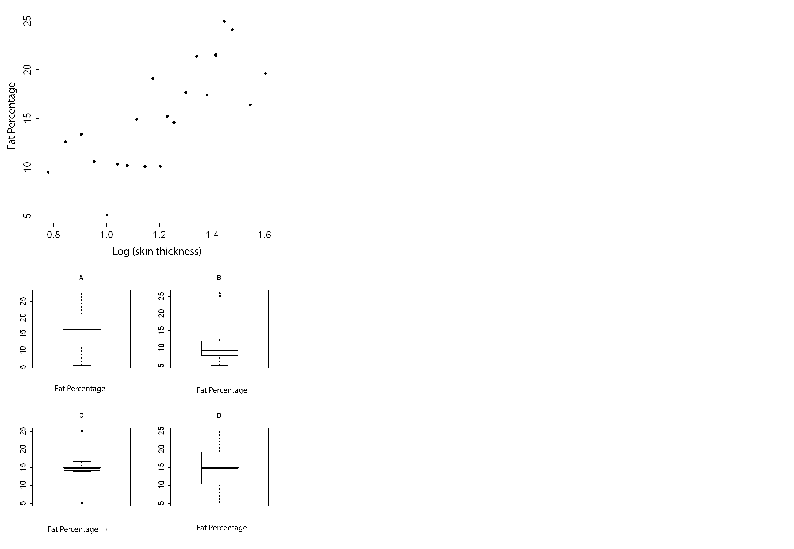

```{r, echo = FALSE, results = "hide"}
include_supplement("uva-graphs-1388-en-graph01.png", recursive = TRUE)
```

Question
========

Fat percentage can be estimated using (the logarithm of) the sum of the skinfold thicknesses of biceps and triceps.______________________ Attached is a scatterplot plotting both of these variables against each other.Ê What does the boxpot of just the fat percentage variable look like?



Answerlist
----------

* A
* B
* C
* D

Solution
========

Answerlist
----------

* A: Incorrect
* B: Incorrect
* C: Incorrect
* D: Correct

Meta-information
================
exname: uva-graphs-1388-en
extype: schoice
exsolution: 0001
exsection: Descriptive statistics/Data representation/Graphs
exextra[ID]: d52a7
exextra[Type]: Conceptual
exextra[Language]: English
exextra[Level]: Statistical Literacy
exextra[IRT-Difficulty]: 0
exextra[p-value]: 0.9242
