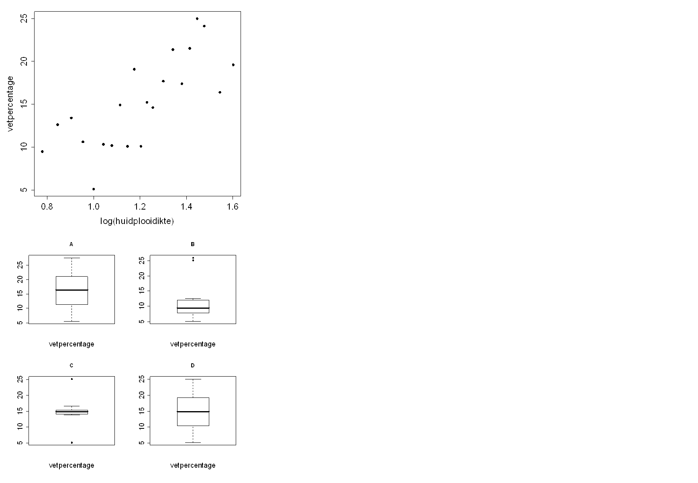

```{r, echo = FALSE, results = "hide"}
include_supplement("uva-graphs-1388-nl-graph01.png", recursive = TRUE)
```

Question
========

Vetpercentage kan geschat worden met behulp van (de logaritme van) de
som van de huidplooidiktes van biceps en triceps.\
Bijgaand is een spreidingsdiagram waarin deze beide variabelen tegen
elkaar staan uitgezet.\
Hoe ziet de boxpot van alleen de variabele vetpercentage eruit?



Answerlist
----------

* A
* B
* C
* D

Solution
========

Answerlist
----------

* A: Incorrect
* B: Incorrect
* C: Incorrect
* D: Correct

Meta-information
================
exname: uva-graphs-1388-nl
extype: schoice
exsolution: 0001
exsection: Descriptive statistics/Data representation/Graphs
exextra[ID]: adf3c
exextra[Type]: Conceptual
exextra[Language]: Dutch
exextra[Level]: Statistical Literacy
exextra[IRT-Difficulty]: 0
exextra[p-value]: 0.9242
