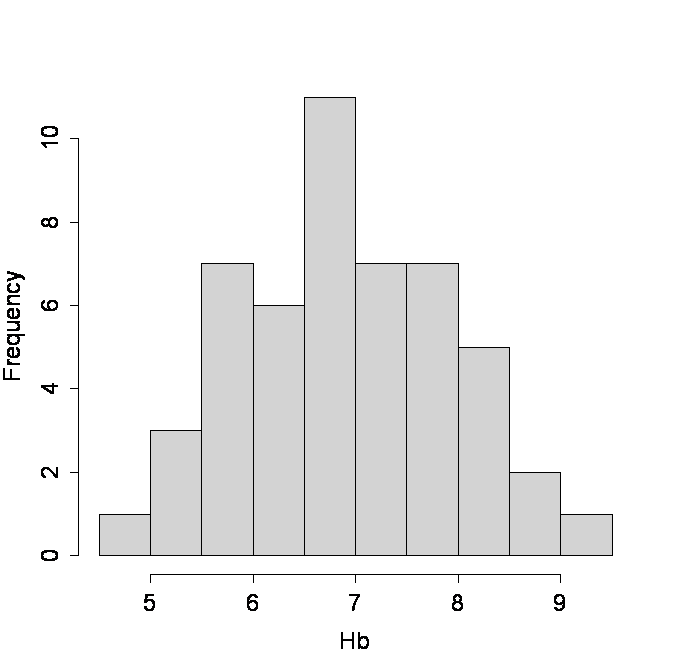

```{r, echo = FALSE, results = "hide"}
include_supplement("uva-histogram-1213-nl-graph01.png", recursive = TRUE)
```

Question
========

Hieronder staat een histogram van het hemoglobine-gehalte (Hb) van een
aantal personen.\
Het aantal personen waarvan het Hb-gehalte is weergegeven is gelijk aan:



Answerlist
----------

35
40
45
50

Solution
========

Answerlist
----------

35: Incorrect
40: Incorrect
45: Incorrect
50: Correct

Meta-information
================
exname: uva-histogram-1213-nl
extype: schoice
exsolution: 0001
exsection: Descriptive statistics/Data representation/Graphs/Histogram
exextra[Type]: Calculation
exextra[Language]: Dutch
exextra[Level]: Statistical Literacy
exextra[IRT-Difficulty]: 0.163
exextra[p-value]: 0.9195
