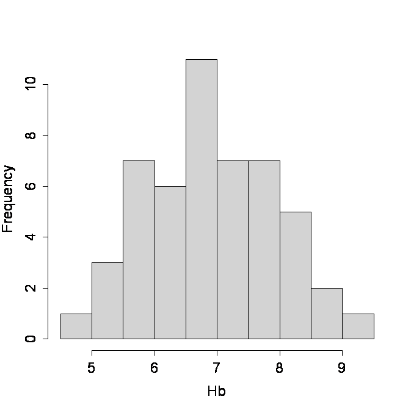

```{r, echo = FALSE, results = "hide"}
include_supplement("uva-histogram-1215-nl-graph01.png", recursive = TRUE)
```

Question
========

Below is a histogram of the haemoglobin (Hb) levels of a number of individuals.Ê The relative frequency of the number of persons with an Hb level of 6 or less is equal to:



Answerlist
----------

* 11%
* 22%
* 39%
* 78%

Solution
========

Answerlist
----------

* 11%: Incorrect
* 22%: Correct
* 39%: Incorrect
* 78%: Incorrect

Meta-information
================
exname: uva-histogram-1215-en
extype: schoice
exsolution: 0100
exsection: Descriptive statistics/Data representation/Graphs/Histogram
exextra[Type]: Conceptual
exextra[Language]: English
exextra[Level]: Statistical Literacy
exextra[IRT-Difficulty]: 2.13
exextra[p-value]: 0.5255
