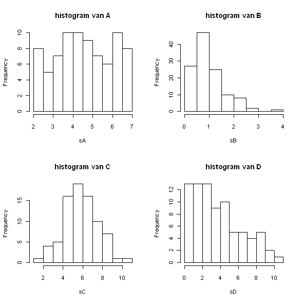

```{r, echo = FALSE, results = "hide"}
include_supplement("uva-histogram-1242-nl-graph01.png", recursive = TRUE)
```

Question
========

Hieronder staan histogrammen van vier steekproeven A t/m D.\
Van welke steekproef is de omvang (*n*) het grootst?



Answerlist
----------

A
B
C
D

Solution
========

Answerlist
----------

A: Incorrect
B: Correct
C: Incorrect
D: Incorrect

Meta-information
================
exname: uva-histogram-1242-nl
extype: schoice
exsolution: 0100
exsection: Descriptive statistics/Data representation/Graphs/Histogram
exextra[Type]: Conceptual
exextra[Language]: Dutch
exextra[Level]: Statistical Literacy
exextra[IRT-Difficulty]: 1.518
exextra[p-value]: 0.8587
