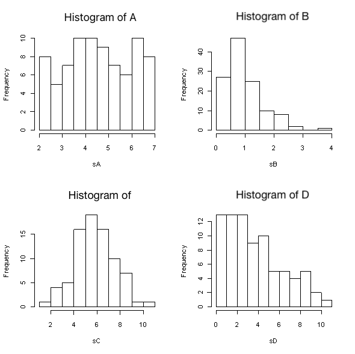

```{r, echo = FALSE, results = "hide"}
include_supplement("uva-histogram-1244-en-graph01.png", recursive = TRUE)
```

Question
========

Below are histograms of four samples A through D. From which sample is the median smallest?



Answerlist
----------

* A
* B
* C
* D

Solution
========

Answerlist
----------

* A: Incorrect
* B: Incorrect
* C: Correct
* D: Incorrect

Meta-information
================
exname: uva-histogram-1244-en
extype: schoice
exsolution: 0010
exsection: Descriptive statistics/Data representation/Graphs/Histogram
exextra[Type]: Conceptual
exextra[Language]: English
exextra[Level]: Statistical Literacy
exextra[IRT-Difficulty]: 1.84
exextra[p-value]: 0.8097
