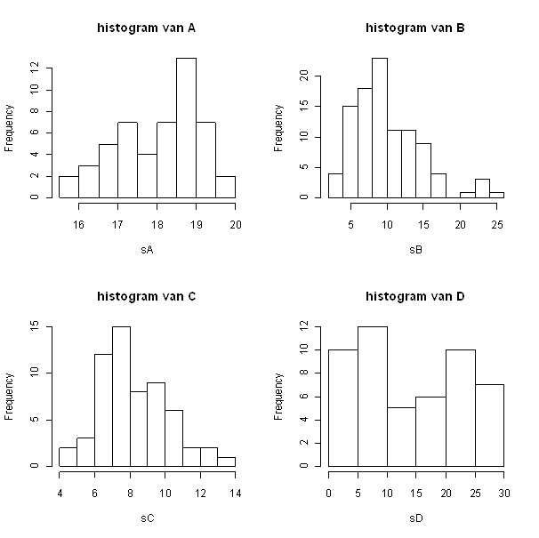

```{r, echo = FALSE, results = "hide"}
include_supplement("uva-histogram-1245-nl-graph01.png", recursive = TRUE)
```

Question
========

Hieronder staan histogrammen van vier steekproeven A t/m D.\
Van welke steekproef is de standaardafwijking het grootst?



Answerlist
----------

* A
* B
* C
* D

Solution
========

Answerlist
----------

* A: Incorrect
* B: Incorrect
* C: Incorrect
* D: Correct

Meta-information
================
exname: uva-histogram-1245-nl
extype: schoice
exsolution: 0001
exsection: Descriptive statistics/Data representation/Graphs/Histogram
exextra[Type]: Conceptual
exextra[Language]: Dutch
exextra[Level]: Statistical Literacy
exextra[IRT-Difficulty]: 1.897
exextra[p-value]: 0.8035
