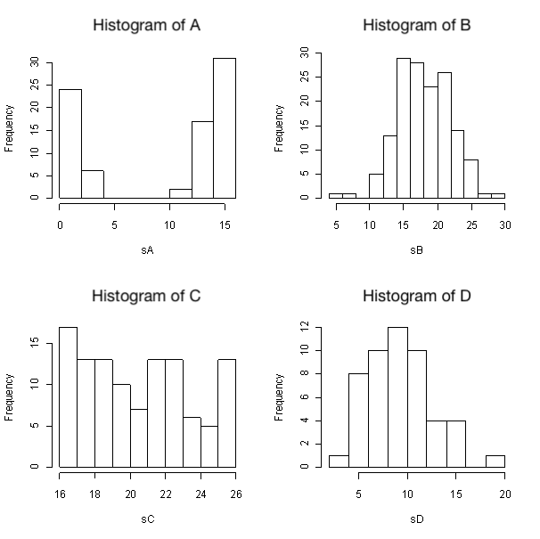

```{r, echo = FALSE, results = "hide"}
include_supplement("uva-histogram-1250-en-graph01.png", recursive = TRUE)
```

Question
========

Below are histograms of four samples A through D. Which sample has the largest size (*n*)?



Answerlist
----------

* A
* B
* C
* D

Solution
========

Answerlist
----------

* A: Incorrect
* B: Correct
* C: Incorrect
* D: Incorrect

Meta-information
================
exname: uva-histogram-1250-en
extype: schoice
exsolution: 0100
exsection: Descriptive statistics/Data representation/Graphs/Histogram
exextra[ID]: 3ba48
exextra[Type]: Conceptual
exextra[Language]: English
exextra[Level]: Statistical Literacy
exextra[IRT-Difficulty]: 0.36
exextra[p-value]: 0.9134
