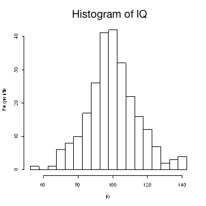

```{r, echo = FALSE, results = "hide"}
include_supplement("uva-histogram-1251-en-graph01.png", recursive = TRUE)
```

Question
========

The attached histogram shows data from an IQ test of 250 individuals shown. The IQs were measured in integers.‖ The class width in this histogram is equal to:



Answerlist
----------

* 2
* 2,5
* 4
* 5

Solution
========

Answerlist
----------

* 2: Incorrect
* 2.5: Incorrect
* 4: Incorrect
* 5: Correct

Meta-information
================
exname: uva-histogram-1251-en
extype: schoice
exsolution: 0001
exsection: Descriptive statistics/Data representation/Graphs/Histogram
exextra[Type]: Conceptual
exextra[Language]: English
exextra[Level]: Statistical Literacy
exextra[IRT-Difficulty]: 2.081
exextra[p-value]: 0.541
