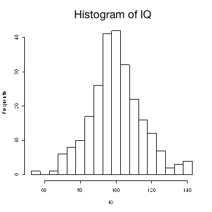

```{r, echo = FALSE, results = "hide"}
include_supplement("uva-histogram-1252-en-graph01.png", recursive = TRUE)
```

Question
========

The attached histogram shows data from an IQ test of 250 individuals shown. The IQs were measured in whole numbers.‖ The largest possible IQ measured in this sample is:



Answerlist
----------

* 140
* 142
* 142.5
* 145
* Not to be determined

Solution
========

Answerlist
----------

* 140: Incorrect
* 142: Incorrect
* 142.5: Correct
* 145: Incorrect
* Undeterminable: Incorrect

Meta-information
================
exname: uva-histogram-1252-en
extype: schoice
exsolution: 00100
exsection: Descriptive statistics/Data representation/Graphs/Histogram
exextra[ID]: 4b581
exextra[Type]: Conceptual
exextra[Language]: English
exextra[Level]: Statistical Literacy
exextra[IRT-Difficulty]: 2.862
exextra[p-value]: 0.4208
