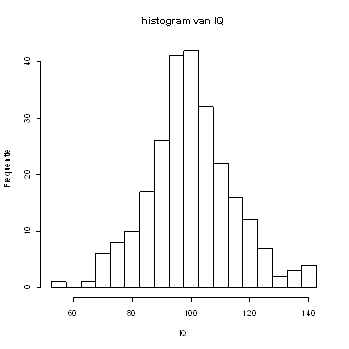

```{r, echo = FALSE, results = "hide"}
include_supplement("uva-histogram-1252-nl-graph01.png", recursive = TRUE)
```

Question
========

In bijgaand histogram zijn de gegevens van een IQ test van 250 personen
weergegeven. De IQ's zijn in gehele getallen gemeten.\
Het grootst mogelijke IQ dat in deze steekproef is gemeten is:



Answerlist
----------

140
142
142.5
145
niet te bepalen

Solution
========

Answerlist
----------

140: Incorrect
142: Incorrect
142.5: Correct
145: Incorrect
niet te bepalen: Incorrect

Meta-information
================
exname: uva-histogram-1252-nl
extype: schoice
exsolution: 00100
exsection: Descriptive statistics/Data representation/Graphs/Histogram
exextra[Type]: Conceptual
exextra[Language]: Dutch
exextra[Level]: Statistical Literacy
exextra[IRT-Difficulty]: 2.862
exextra[p-value]: 0.4208
