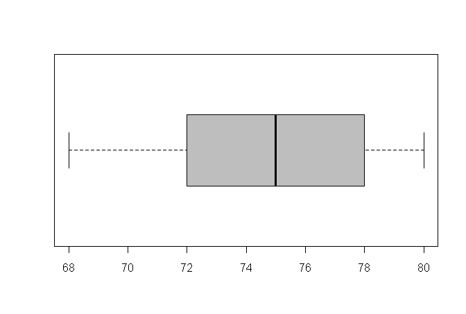

```{r, echo = FALSE, results = "hide"}
include_supplement("uva-interquartile-range-1203-nl-graph01.png", recursive = TRUE)
```

Question
========

Weight (in whole kilograms) was measured in 41 individuals. The results are shown in the attached boxplot.Ê One of the 4 statements below about the boxplot is not TRUE. Which statement is NOT TRUE?



Answerlist
----------

* The third quartile is larger than the first quartile.
* There are no outliers ("outliers") in this boxplot.
* The spread width of these numbers is equal to 12.
* The largest observation is further away from the median than the smallest observation.

Solution
========

Answerlist
----------

* The third quartile is larger than the first quartile: Incorrect
* There are no outliers in this boxplot: Incorrect
* The spread width of these numbers equals 12.: Incorrect
* The largest observation is further away from the median than the smallest observation...: Correct

Meta-information
================
exname: uva-interquartile-range-1203-en
extype: schoice
exsolution: 0001
exsection: Descriptive statistics/Summary Statistics/Measures of Spread/Interquartile Range
exextra[Type]: Conceptual
exextra[Language]: English
exextra[Level]: Statistical Literacy
exextra[IRT-Difficulty]: 1.72
exextra[p-value]: 0.8422
