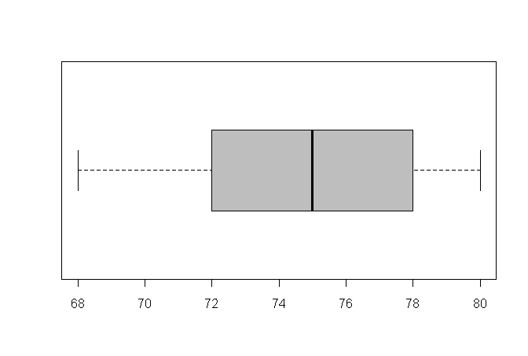

```{r, echo = FALSE, results = "hide"}
include_supplement("uva-interquartile-range-1203-nl-graph01.png", recursive = TRUE)
```

Question
========

Bij 41 personen is het gewicht (in gehele kilogrammen) gemeten. De
uitkomsten zijn weergegeven in bijgaande boxplot.\
Eén van onderstaande 4 beweringen over de boxplot is niet waar. Welke
bewering is NIET waar?



Answerlist
----------

Het derde kwartiel is groter dan het eerste kwartiel.
Er bevinden zich in deze boxplot geen uitbijters ("outliers").
De spreidingsbreedte van deze getallen is gelijk aan 12.
De grootste waarneming ligt verder af van de mediaan dan de kleinste waarneming.

Solution
========

Answerlist
----------

Het derde kwartiel is groter dan het eerste kwartiel.: Incorrect
Er bevinden zich in deze boxplot geen uitbijters ("outliers").: Incorrect
De spreidingsbreedte van deze getallen is gelijk aan 12.: Incorrect
De grootste waarneming ligt verder af van de mediaan dan de kleinste waarneming.: Correct

Meta-information
================
exname: uva-interquartile-range-1203-nl
extype: schoice
exsolution: 0001
exsection: Descriptive statistics/Summary Statistics/Measures of Spread/Interquartile Range
exextra[Type]: Conceptual
exextra[Language]: Dutch
exextra[Level]: Statistical Literacy
exextra[IRT-Difficulty]: 1.72
exextra[p-value]: 0.8422
