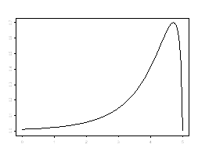

```{r, echo = FALSE, results = "hide"}
include_supplement("uva-measures-of-location-1238-nl-graph01.png", recursive = TRUE)
```

Question
========

In the accompanying distribution, the relationship between mean, mode and median is as follows:



Answerlist
----------

* Mode > median > mean
* Median > mode > mean
* Mean > mode > median
* Mode > mean > median

Solution
========

Answerlist
----------

* Mode > median > mean: Correct
* Median > mode > mean: Incorrect
* Mean > mode > median: Incorrect
* Mode > mean > median: Incorrect

Meta-information
================
exname: uva-measures-of-location-1238-en
extype: schoice
exsolution: 1000
exsection: Descriptive statistics/Summary Statistics/Measures of Location
exextra[Type]: Conceptual
exextra[Language]: English
exextra[Level]: Statistical Literacy
exextra[IRT-Difficulty]: 1.853
exextra[p-value]: 0.8076
