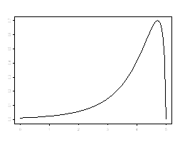

```{r, echo = FALSE, results = "hide"}
include_supplement("uva-measures-of-location-1238-nl-graph01.png", recursive = TRUE)
```

Question
========

In bijgaande verdeling is de relatie tussen gemiddelde, modus en mediaan
als volgt:



Answerlist
----------

* modus > mediaan > gemiddelde
* mediaan > modus > gemiddelde
* gemiddelde > modus > mediaan
* modus > gemiddelde > mediaan

Solution
========

Answerlist
----------

* modus > mediaan > gemiddelde: Correct
* mediaan > modus > gemiddelde: Incorrect
* gemiddelde > modus > mediaan: Incorrect
* modus > gemiddelde > mediaan: Incorrect

Meta-information
================
exname: uva-measures-of-location-1238-nl
extype: schoice
exsolution: 1000
exsection: Descriptive statistics/Summary Statistics/Measures of Location
exextra[Type]: Conceptual
exextra[Language]: Dutch
exextra[Level]: Statistical Literacy
exextra[IRT-Difficulty]: 1.853
exextra[p-value]: 0.8076
