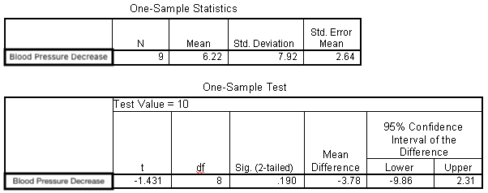

```{r, echo = FALSE, results = "hide"}
include_supplement("uva-measures-of-location-351-nl-graph01.png", recursive = TRUE)
```

Question
========

Below is SPSS output from a sample T test regarding decrease in blood pressure after medication. The 95% two-sided confidence interval for μ is equal to



Answerlist
----------

* (- 12.04 ; 24.48)
* (- 9.86 ; 2.31)
* (0.14; 12.31 )
* (0.24; 12.19)

Solution
========

Answerlist
----------

* (- 12.04 ; 24.48): Incorrect
* (- 9.86 ; 2.31): Incorrect
* (0.14; 12.31 ): Correct
* (0.24; 12.19): Incorrect

Meta-information
================
exname: uva-measures-of-location-351-en
extype: schoice
exsolution: 0010
exsection: Descriptive statistics/Summary Statistics/Measures of Location
exextra[Type]: Interpreting output
exextra[Language]: English
exextra[Level]: Statistical Literacy
exextra[IRT-Difficulty]: 3.207
exextra[p-value]: 0.2537
