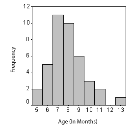

```{r, echo = FALSE, results = "hide"}
include_supplement("uva-median-334-en-graph01.gif", recursive = TRUE)
```

Question
========

The adjacent chart shows the age (in months) of 40 babies at which their first tooth broke through. Which of the following statements concerning median and mean is correct?



Answerlist
----------

* Median is smaller than mean
* Median and mean are equal
* Median is greater than mean
* Median and mean are not comparable here

Solution
========

Answerlist
----------

* Median is smaller than mean: Correct
* Median and mean are equal: Incorrect
* Median is greater than mean: Incorrect
* Median and mean are not comparable here: Incorrect

Meta-information
================
exname: uva-median-334-en
extype: schoice
exsolution: 1000
exsection: Descriptive statistics/Summary Statistics/Measures of Location/Median
exextra[Type]: Conceptual
exextra[Language]: English
exextra[Level]: Statistical Literacy
exextra[IRT-Difficulty]: 2.198
exextra[p-value]: 0.5039
