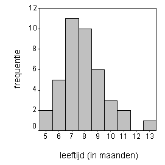

```{r, echo = FALSE, results = "hide"}
include_supplement("uva-median-334-nl-graph01.png", recursive = TRUE)
```

Question
========

In nevenstaande grafiek staat van 40 baby's de leeftijd (in maanden)
waarop hun eerste tand doorbrak. Welke van de onderstaande beweringen
omtrent mediaan en gemiddelde is juist?



Answerlist
----------

* mediaan is kleiner dan gemiddelde
* mediaan en gemiddelde zijn gelijk
* mediaan is groter dan gemiddelde
* mediaan en gemiddelde zijn hier niet te vergelijken

Solution
========

Answerlist
----------

* mediaan is kleiner dan gemiddelde: Correct
* mediaan en gemiddelde zijn gelijk: Incorrect
* mediaan is groter dan gemiddelde: Incorrect
* mediaan en gemiddelde zijn hier niet te vergelijken: Incorrect

Meta-information
================
exname: uva-median-334-nl
extype: schoice
exsolution: 1000
exsection: Descriptive statistics/Summary Statistics/Measures of Location/Median
exextra[Type]: Conceptual
exextra[Language]: Dutch
exextra[Level]: Statistical Literacy
exextra[IRT-Difficulty]: 2.198
exextra[p-value]: 0.5039
