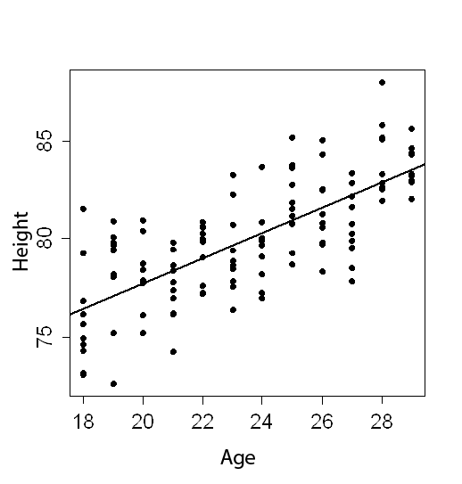

```{r, echo = FALSE, results = "hide"}
include_supplement("uva-scatterplot-1255-en-graph01.png", recursive = TRUE)
```

Question
========

Of a number of children, age was determined in months, and height in centimeters. The data are plotted in the attached scatterplot.â The height of a child in the age interval 18 -- 28 months increases per month by an average of:



Answerlist
----------

* 0.48 cm
* 0.64 cm
* 0.84 cm
* 1.57 cm

Solution
========

Answerlist
----------

* 0.48 cm: Incorrect
* 0.64 cm: Correct
* 0.84 cm: Incorrect
* 1.57 cm: Incorrect

Meta-information
================
exname: uva-scatterplot-1255-en
extype: schoice
exsolution: 0100
exsection: Descriptive statistics/Data representation/Graphs/Scatterplot
exextra[Type]: Conceptual
exextra[Language]: English
exextra[Level]: Statistical Literacy
exextra[IRT-Difficulty]: 3.964
exextra[p-value]: 0.131
