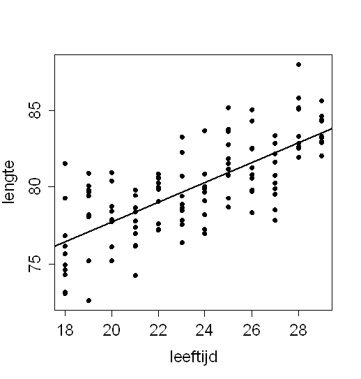

```{r, echo = FALSE, results = "hide"}
include_supplement("uva-scatterplot-1259-nl-graph01.png", recursive = TRUE)
```

Question
========

Van een aantal kinderen is de leeftijd in maanden bepaald, en de lengte
in centimeters. De gegevens zijn uitgezet in bijgaand
spreidingsdiagram.\
Wanneer aan deze steekproef een kind wordt toegevoegd van 19 maanden,
met een lengte van 82.0 cm zal de asafsnede (intercept) van de
regressielijn:



Answerlist
----------

kleiner worden
ongeveer gelijk blijven
groter worden

Solution
========

Answerlist
----------

kleiner worden: Incorrect
ongeveer gelijk blijven: Incorrect
groter worden: Correct

Meta-information
================
exname: uva-scatterplot-1259-nl
extype: schoice
exsolution: 001
exsection: Descriptive statistics/Data representation/Graphs/Scatterplot
exextra[Type]: Conceptual
exextra[Language]: Dutch
exextra[Level]: Statistical Literacy
exextra[IRT-Difficulty]: 4
exextra[p-value]: 0.115
