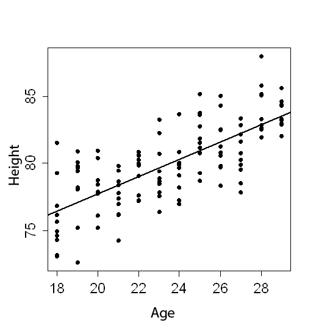

```{r, echo = FALSE, results = "hide"}
include_supplement("uva-scatterplot-1264-en-graph01.png", recursive = TRUE)
```

Question
========

Of a number of children, age was determined in months, and height in centimeters. The data are plotted in the attached scatterplot.â When a child aged 23.5 months is added to this sample, with a height of 80.0 cm, the directional coefficient of the regression line:



Answerlist
----------

* Get smaller
* Remain about the same
* Increase

Solution
========

Answerlist
----------

* Get smaller: Incorrect
* Stay about the same: Correct
* Get bigger: Incorrect

Meta-information
================
exname: uva-scatterplot-1264-en
extype: schoice
exsolution: 010
exsection: Descriptive statistics/Data representation/Graphs/Scatterplot
exextra[Type]: Conceptual
exextra[Language]: English
exextra[Level]: Statistical Literacy
exextra[IRT-Difficulty]: 4
exextra[p-value]: 0.115
