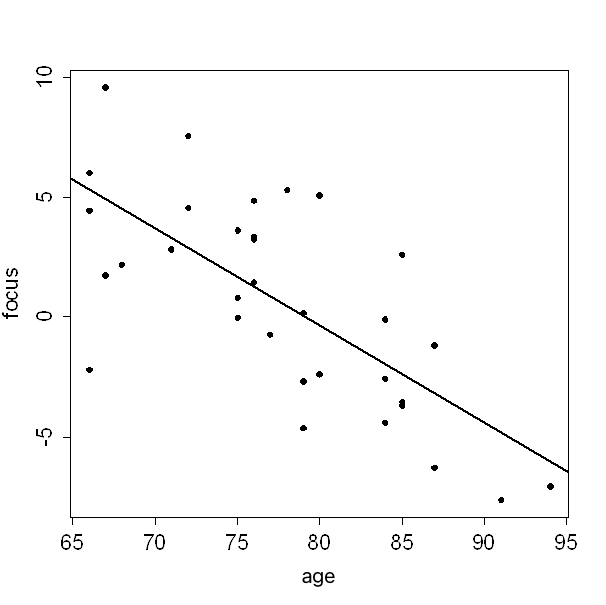

```{r, echo = FALSE, results = "hide"}
include_supplement("uva-scatterplot-1395-en-graph01.png", recursive = TRUE)
```

Question
========

One study examined the relationship between age and the ability to focus on something. Below is a scatterplot of the results, along with the corresponding regression line.______________________________. The sample included one 71-year-old. His ability to focus was equal to:



Answerlist
----------

* 2.83
* 4.57
* 7.57
* 9.61

Solution
========

Answerlist
----------

* 2.83: Correct
* 4.57: Incorrect
* 7.57: Incorrect
* 9.61: Incorrect

Meta-information
================
exname: uva-scatterplot-1395-en
extype: schoice
exsolution: 1000
exsection: Descriptive statistics/Data representation/Graphs/Scatterplot
exextra[ID]: 789ad
exextra[Type]: Calculation
exextra[Language]: English
exextra[Level]: Statistical Literacy
exextra[IRT-Difficulty]: 0
exextra[p-value]: 0.9242
