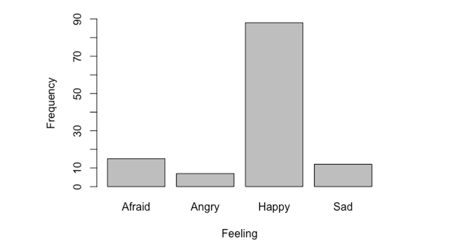

```{r, echo = FALSE, results = "hide"}
include_supplement("vufgb-bargraph-001-en-graph-01.png", recursive = TRUE)
```
Question
========
  
Op een willekeurig gekozen moment wordt aan een groep kinderen gevraagd hoe ze zich op dat moment voelen. De resultaten worden weergegeven in het staafdiagram hieronder. Welke conclusie over de resultaten is juist?

 
  
Answerlist
----------
* De variabele Gevoel is een ordinale variabele.
* De variabele Gevoel is bij benadering normaal verdeeld.
* Het percentage kinderen dat zich gelukkig voelt ligt tussen 80 en 90%.
* Op de y-as worden de absolute frequenties weergegeven.

Solution
========

Answerlist
----------
* Onjuist
* Onjuist
* Onjuist
* Juist

Meta-information
================
exname: vufgb-bargraph-001-nl
extype: schoice
exsolution: 0001
exsection: Descriptive statistics/Data representation/Graphs/Bar graph
exextra[Type]: Conceptual, Interpreting graph
exextra[Language]: Dutch
exextra[Level]: Statistical Reasoning
