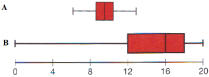

```{r, echo = FALSE, results = "hide"}
include_supplement("vufgb-boxplot-001-en.png", recursive = TRUE)
```

Question
========
The distributions of two variables (A and B) are shown in the boxplots below.



Fill in the blanks: 

i. The mean for variable A will be ... the median. 
ii. The distribution of variable B ... .

Answerlist
----------
* i: equal to, ii: is skewed to the left.
* i: to the left of, ii: is skewed to the right.
* i: equal to, ii: is skewed to the right.
* i: to the right of,	ii: is symmetric.


Solution
========

Answerlist
----------
* Correct
* Incorrect
* Incorrect
* Incorrect


Meta-information
================
exname: vufgb-boxplot-001-en
extype: schoice
exsolution: 1000
exsection: Descriptive statistics/Data representation/Graphs/Boxplot
exextra[Type]: Interpreting graph
exextra[Language]: English
exextra[Level]: Statistical Thinking
