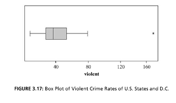

```{r, echo = FALSE, results = "hide"}
include_supplement("vufgb-boxplot-002-nl-boxplot01.jpg", recursive = TRUE)
```

Question
========

Given is the boxplot below for the variable "violent". Which statement is TRUE?


  
Answerlist
----------
* The variable is quantitative, and skewed to the right.
* The variable is quantitative, and skewed to the left.
* The variable is categorical, and skewed to the right.
* The variable is categorical, and skewed to the left.

Solution
========

Answerlist
----------
* Correct
* Incorrect
* Incorrect
* Incorrect

Meta-information
================
exname: vufgb-boxplot-002-en
extype: schoice
exsolution: 1000
exsection: Descriptive statistics/Data representation/Graphs/Boxplot, Variable type
exextra[ID]: 3dad5
exextra[Type]: Interpreting graph
exextra[Program]: 
exextra[Language]: English
exextra[Level]: Statistical Literacy
