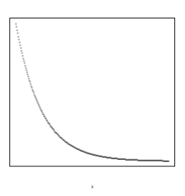

```{r, echo = FALSE, results = "hide"}
include_supplement("vufgb-correlation-005-nl-graph01.jpg", recursive = TRUE)
```

Question
========

The figure below shows the relationship between x and y.



What is the correlation between x and y? 
Answerlist
----------
* -1
* -0.8
* 0
* 0.8

Solution
========

Answerlist
----------
* Incorrect
* Correct
* Incorrect
* Incorrect

Meta-information
================
exname: vufgb-correlatioon-005-en
extype: schoice
exsolution: 0100
exsection: Descriptive statistics/Summary Statistics/Bivariate statistics/Correlation
exextra[ID]: 1d68d
exextra[Type]: Calculation, Interpreting graph
exextra[Program]: 
exextra[Language]: English
exextra[Level]: Statistical Thinking
