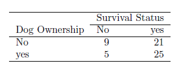

```{r, echo = FALSE, results = "hide"}
include_supplement("vufgb-frequencytable-002-nl-table01.jpg", recursive = TRUE)
```

Question
========

A study of the relationship between dog ownership and health produced the following table.


  
Under independence, what is the expected frequency for the cell: Yes-Yes?  
  
Answerlist
----------
* 23
* 7
* 14
* 9

Solution
========

Answerlist
----------
* Correct
* Incorrect
* Incorrect
* Incorrect

Meta-information
================
exname: vufgb-frequencytable-002-en
extype: schoice
exsolution: 1000
exsection: Descriptive statistics/Data representation/Tables/Frequency table
exextra[Type]: Interpreting output, Calculation
exextra[Program]: 
exextra[Language]: English
exextra[Level]: Statistical Literacy
