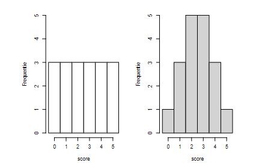

```{r, echo = FALSE, results = "hide"}
include_supplement("vufgb-histogram-001-nl-table01.jpg", recursive = TRUE)
```

Question
========

Complete the statements on the two histograms below.

The two averages differ ... .

The standard deviation is larger for the ... histogram.


  
Answerlist
----------
* Well, right
* Yes, left
* Not, left
* Not, right

Solution
========

Answerlist
----------
* Incorrect
* Incorrect
* Correct
* Incorrect

Meta-information
================
exname: vufgb-histogram-001-en
extype: schoice
exsolution: 0010
exsection: Descriptive statistics/Data representation/Graphs/Histogram, Descriptive statistics/Summary Statistics/Measures of Location/Mean, Inferential Statistics/Sampling Distributions
exextra[Type]: Interpreting graph
exextra[Program]: 
exextra[Language]: English
exextra[Level]: Statistical Literacy
