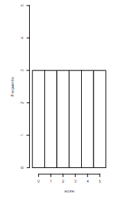
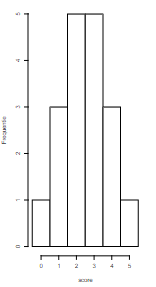
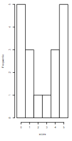

```{r, echo = FALSE, results = "hide"}
include_supplement("vufgb-histogram-002-nl-histogram01.jpg", recursive = TRUE)
```

```{r, echo = FALSE, results = "hide"}
include_supplement("vufgb-histogram-002-nl-histogram02.jpg", recursive = TRUE)
```

```{r, echo = FALSE, results = "hide"}
include_supplement("vufgb-histogram-002-nl-histogram03.jpg", recursive = TRUE)
```

Question
========

Here are three histograms showing the frequency on the Y-axis and a score on the X-axis. Which of the histograms below shows the most variance?

1:

2:

3:


Answerlist
----------
* 1
* 2
* 3
* All three equally

Solution
========

Answerlist
----------
* Incorrect
* Incorrect
* Correct
* Incorrect

Meta-information
================
exname: vufgb-histogram-002-en
extype: schoice
exsolution: 0010
exsection: Descriptive statistics/Data representation/Graphs/Histogram, Descriptive statistics/Summary Statistics/Measures of Spread/Variance
exextra[ID]: 3c729
exextra[Type]: Interpreting graph
exextra[Program]: 
exextra[Language]: English
exextra[Level]: Statistical Literacy
