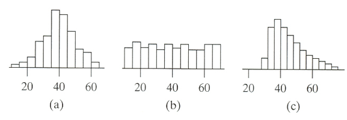

```{r, echo = FALSE, results = "hide"}
include_supplement("vufgb-histogram-003-nl-histogram01.jpg", recursive = TRUE)
```

Question
========

Given are three histograms.

In which histogram is the spread the largest?


  
Answerlist
----------
* Histogram (a)
* Histogram (b)
* Histogram (c)
* The dispersion is the same in all three histograms.

Solution
========

Answerlist
----------
* Incorrect
* Correct
* Incorrect
* Incorrect

Meta-information
================
exname: vufgb-histogram-003-en
extype: schoice
exsolution: 0100
exsection: Descriptive statistics/Data representation/Graphs/Histogram
exextra[Type]: Interpreting graph
exextra[Program]: 
exextra[Language]: English
exextra[Level]: Statistical Literacy
