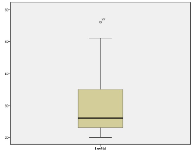

```{r, echo = FALSE, results = "hide"}
include_supplement("vufgb-histogram-004-nl-boxplot01.jpg", recursive = TRUE)
```

Question
========

See the boxplot below, which shows the distribution of the variable Age. 


  
Suppose instead of a boxplot you were to make a histogram of age. What would the distribution of age scores look like? 
Answerlist
----------
* The distribution is skewed to the right.
* The distribution is skewed to the left.
* The scores are normally distributed.
* The scores are uniformly distributed.

Solution
========

Answerlist
----------
* Correct
* Incorrect
* Incorrect
* Incorrect

Meta-information
================
exname: vufgb-histogram-004-en
extype: schoice
exsolution: 1000
exsection: Descriptive statistics/Data representation/Graphs/Histogram, Descriptive statistics/Data representation/Graphs/Boxplot
exextra[Type]: Interpreting graph, Creating graphs, Conceptual
exextra[Program]: 
exextra[Language]: English
exextra[Level]: Statistical Reasoning
