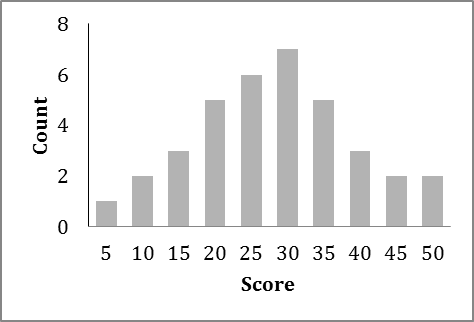

```{r, echo = FALSE, results = "hide"}
include_supplement("vufgb-interquartilerange-001-en.png", recursive = TRUE)
```

Question
========
Below is the distribution of scores on a language test. 



The sample contained 36 students. For this distribution, compute the interquartile range (IQR). 

Answerlist
----------
* 5
* 15
* 30
* 45

Meta-information
================
exname: vufgb-interquartilerange-001-en
extype: schoice
exsolution: 0100
exsection: Descriptive statistics/Summary Statistics/Measures of Spread/Interquartile Range
exextra[ID]: f3401
exextra[Type]: Interpreting graph, Calculation, Case
exextra[Language]: English
exextra[Level]: Statistical Thinking
