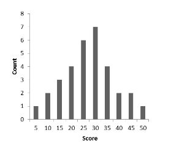

```{r, echo = FALSE, results = "hide"}
include_supplement("vufgb-interquartilerange-003-nl-bargraph01.jpg", recursive = TRUE)
```

Question
========
  
Hieronder zie je de verdeling van de behaalde scores van 32 leerlingen op een rekentoets. Bepaal de **interkwartielafstand** (***interquartile range***) voor deze verdeling. 


  
Answerlist
----------
* 5
* 15
* 20
* 35

Solution
========

Answerlist
----------
* Incorrect
* Correct
* Incorrect
* Incorrect

Meta-information
================
exname: vufgb-interquartilerange-003-nl
extype: schoice
exsolution: 0100
exsection: Descriptive statistics/Summary Statistics/Measures of Spread/Interquartile Range, Descriptive statistics/Data representation/Graphs/Bar graph
exextra[Type]: Calculation
exextra[Program]: 
exextra[Language]: Dutch
exextra[Level]: Statistical Thinking