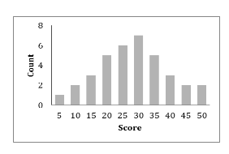

```{r, echo = FALSE, results = "hide"}
include_supplement("vufgb-interquartilerange-004-en-bargraph01.jpg", recursive = TRUE)
```

Question
========
  
Below is the distribution of scores on a language test for 36 students. Compute the interquartile range (IQR) for this distribution. 



  
Answerlist
----------
* 5
* 15
* 20
* 35

Solution
========

Answerlist
----------
* Incorrect
* Correct
* Incorrect
* Incorrect

Meta-information
================
exname: vufgb-interquartilerange-004-en
extype: schoice
exsolution: 0100
exsection: Descriptive statistics/Summary Statistics/Measures of Spread/Interquartile Range, Descriptive statistics/Data representation/Graphs/Boxplot
exextra[Type]: Interpretating graph
exextra[Program]: 
exextra[Language]: English
exextra[Level]: Statistical Literacy