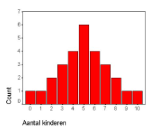

```{r, echo = FALSE, results = "hide"}
include_supplement("vufgb-interquartilerange-005-nl-bargraph01.jpg", recursive = TRUE)
```

Question
========
  
Hieronder zie je de verdeling van het aantal kinderen in een steekproef van 28 Vlaamse gezinnen in 1925. Bepaal de interkwartielafstand (*interquartile range*) voor deze verdeling.


  
Answerlist
----------
* 1
* 3
* 8
* 10


Solution
========

Answerlist
----------
* Incorrect
* Correct
* Incorrect
* Incorrect

Meta-information
================
exname: vufgb-interquartilerange-005-nl
extype: schoice
exsolution: 0100
exsection: Descriptive statistics/Summary Statistics/Measures of Spread/Interquartile Range, Descriptive statistics/Data representation/Graphs/Bar graph
exextra[ID]: 4cd1e
exextra[Type]: Interpreting graph
exextra[Program]: 
exextra[Language]: Dutch
exextra[Level]: Statistical Literacy
