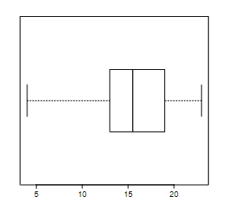

```{r, echo = FALSE, results = "hide"}
include_supplement("vufgb-interquartilerange-006-nl-boxplot01.jpg", recursive = TRUE)
```

Question
========

The image below shows a boxplot.


  
How large is the *interquartile range*?  
  
Answerlist
----------
* 2.5
* 4.25
* 5.75
* 9

Solution
========

Answerlist
----------
* Incorrect
* Incorrect
* Correct
* Incorrect

Meta-information
================
exname: vufgb-interquartilerange-006-en
extype: schoice
exsolution: 0010
exsection: Descriptive statistics/Summary Statistics/Measures of Spread/Interquartile Range, Descriptive statistics/Data representation/Graphs/Boxplot
exextra[ID]: eebf1
exextra[Type]: Calculation, Interpreting graph
exextra[Program]: 
exextra[Language]: English
exextra[Level]: Statistical Thinking
