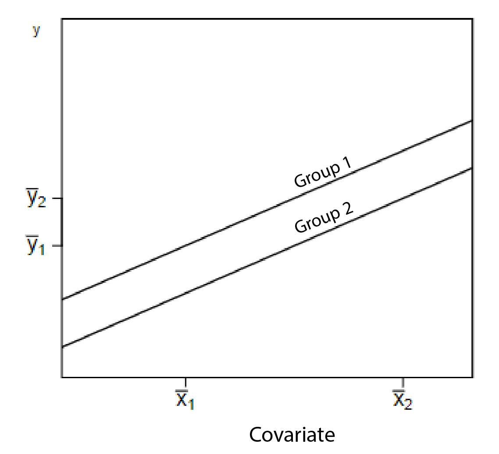

```{r, echo = FALSE, results = "hide"}
include_supplement("vufgb-mean-001-en-graph01.png", recursive = TRUE)
```

Question
========

The picture below shows the estimated regression lines associated with an ANCOVA model. Also shown are the raw (unadjusted) averages for *x* and *y*. What can one conclude about the raw differences on *y* on the one hand and the adjusted (unadjusted) averages on the other?


  
Complete:

The adjusted averages... 
Answerlist
----------
* ...differ more than the raw averages.
* ...differ less than the raw averages.
* ...have a different ranking than the raw averages.
* ...do not differ from the raw averages.

Solution
========

Answerlist
----------
* Incorrect
* Incorrect
* Correct
* Incorrect

Meta-information
================
exname: vufgb-mean-001-en
extype: schoice
exsolution: 0010
exsection: Descriptive statistics/Summary Statistics/Measures of Location/Mean, Inferential Statistics/Parametric Techniques/ANOVA/ANCOVA, Inferential Statistics/Regression
exextra[ID]: 9fc8a
exextra[Type]: Interpreting graph
exextra[Program]: 
exextra[Language]: English
exextra[Level]: Statistical Literacy
