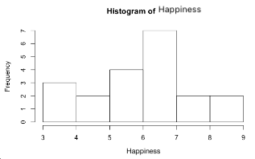

```{r, echo = FALSE, results = "hide"}
include_supplement("vufgb-mean-002-en-histogram01.png", recursive = TRUE)
```

Question
========

In a sample of parents with young children, how happy they feel (expressed in whole numbers on a scale of 1 to 10) was measured. The histogram below shows the distribution of scores.

Calculate the average score on Happiness.


  
Answerlist
----------
* 6.0
* 5.5
* 6.5
* 7.0

Solution
========

Answerlist
----------
* Incorrect
* Correct
* Incorrect
* Incorrect

Meta-information
================
exname: vufgb-mean-002-en
extype: schoice
exsolution: 0100
exsection: Descriptive statistics/Summary Statistics/Measures of Location/Mean, Descriptive statistics/Data representation/Graphs/Histogram
exextra[ID]: fc380
exextra[Type]: Calculation, Interpreting graph
exextra[Program]: 
exextra[Language]: English
exextra[Level]: Statistical Literacy
