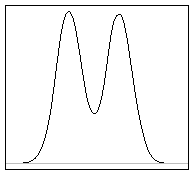

```{r, echo = FALSE, results = "hide"}
include_supplement("vufgb-measuresoflocation-001-nl.png", recursive = TRUE)
```

Question
========
Hieronder zie je een tweetoppige ("bimodale") verdeling. 



Welke uitspraak is waar?

Answerlist
----------
* De mediaan is ongeveer gelijk aan het gemiddelde.
* De modus is ongeveer gelijk aan het gemiddelde.
* De modus is ongeveer gelijk aan de mediaan.
* De mediaan, modus en het gemiddelde zijn allemaal ongeveer gelijk aan elkaar.

Meta-information
================
exname: vufgb-measuresoflocation-001-nl
extype: schoice
exsolution: 10
exsection: Descriptive statistics/Summary Statistics/Measures of Location, Descriptive statistics/Summary Statistics/Measures of Location/Mean, Descriptive statistics/Summary Statistics/Measures of Location/Median
exextra[Type]: Conceptual, Interpretating graph
exextra[Language]: Dutch
exextra[Level]: Statistical Thinking