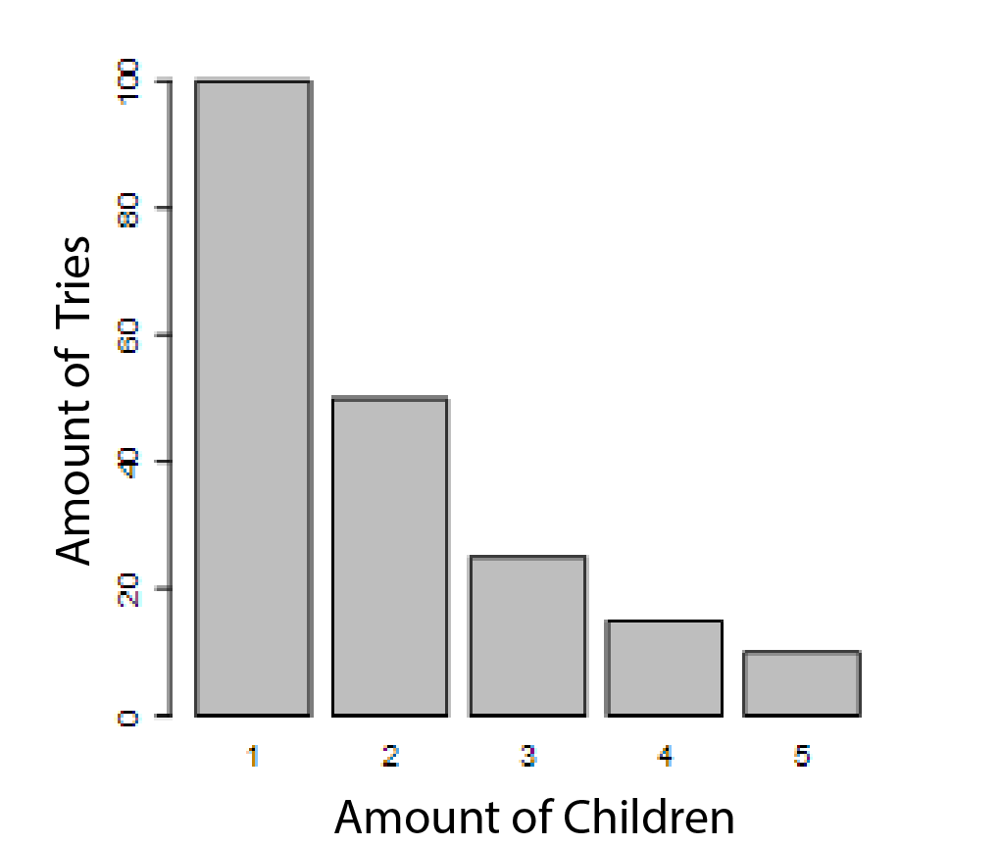

```{r, echo = FALSE, results = "hide"}
include_supplement("vufgb-measuresoflocation-003-en-bargraph01.png", recursive = TRUE)
```

Question
========

The picture below shows the number of attempts of 200 people in the driving test for a car license.


  
In this situation, how do the mode, median and mean visibility compare?  
  
Answerlist
----------
* Median < mode < mean
* Mode < mean < median
* Mean < mode < median
* Mode < median < mean

Solution
========

Answerlist
----------
* Incorrect
* Incorrect
* Incorrect
* Correct

Meta-information
================
exname: vufgb-measuresoflocation-003-en
extype: schoice
exsolution: 0001
exsection: Descriptive statistics/Summary Statistics/Measures of Location, Descriptive statistics/Summary Statistics/Measures of Location/Mean, Descriptive statistics/Summary Statistics/Measures of Location/Median, Descriptive statistics/Summary Statistics/Measures of Location/Mode, Descriptive statistics/Data representation/Graphs/Bar graph
exextra[Type]: Conceptual, Interpreting graph
exextra[Program]: 
exextra[Language]: English
exextra[Level]: Statistical Literacy
