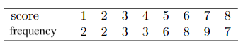

```{r, echo = FALSE, results = "hide"}
include_supplement("vufgb-measuresoflocation-005-en-frequencytable01.npg", recursive = TRUE)
```

Question
========

Given is the following frequency distribution:


  
Complete.

This distribution is skewed toward ... . The mode lies ... from the mean.  
  
Answerlist
----------
* Left, right
* Left, left
* Right, right
* Right, left

Solution
========

Answerlist
----------
* Correct
* Incorrect
* Incorrect
* Incorrect

Meta-information
================
exname: vufgb-measuresoflocation-005-en
extype: schoice
exsolution: 1000
exsection: Descriptive statistics/Summary Statistics/Measures of Location, Descriptive statistics/Summary Statistics/Measures of Location/Mode, Descriptive statistics/Summary Statistics/Measures of Location/Mean, Descriptive statistics/Data representation/Tables/Frequency table
exextra[ID]: 4b776
exextra[Type]: Interpreting output, Conceptual
exextra[Program]: 
exextra[Language]: English
exextra[Level]: Statistical Literacy
