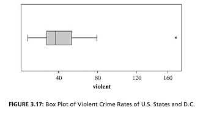

```{r, echo = FALSE, results = "hide"}
include_supplement("vufgb-measuresoflocation-006-nl-boxplot01.jpg", recursive = TRUE)
```

Question
========

Given is the boxplot below.

Complete.

The mean is ... from the median, and the distribution is skewed toward ... .


  
Answerlist
----------
* Right; Right
* Right; Left
* Left; Right
* Left; Left

Solution
========

Answerlist
----------
* Correct
* Incorrect
* Incorrect
* Incorerct

Meta-information
================
exname: vufgb-measuresoflocation-006-en
extype: schoice
exsolution: 1000
exsection: Descriptive statistics/Summary Statistics/Measures of Location, Descriptive statistics/Data representation/Graphs/Boxplot, Descriptive statistics/Summary Statistics/Measures of Location/Mean, Descriptive statistics/Summary Statistics/Measures of Location/Median
exextra[Type]: Interpreting graph, Conceptual
exextra[Program]: 
exextra[Language]: English
exextra[Level]: Statistical Literacy
