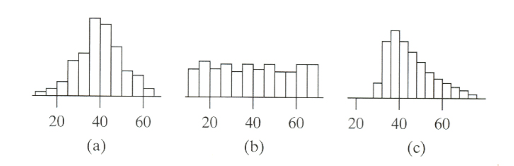

```{r, echo = FALSE, results = "hide"}
include_supplement("vufgb-measuresofspread-001-en-graph-01.png", recursive = TRUE)
```
Question
========
  
Three histograms are provided below. Which histogram shows the largest spread?



Answerlist
----------
* Histogram (a).
* Histogram (b).
* Histogram (c).
* The spread is equal in all three histograms.

Solution
========

Answerlist
----------
* Incorrect
* Correct
* Incorrect 
* Incorrect

Meta-information
================
exname: vufgb-measuresofspread-001-en 
extype: schoice
exsolution: 0100
exsection: Descriptive statistics/Summary Statistics/Measures of Spread, Descriptive statistics/Data representation/Graphs/Histogram
exextra[Type]: Interpreting graph
exextra[Language]: English
exextra[Level]: Statistical Reasoning
