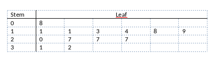

```{r, echo = FALSE, results = "hide"}
include_supplement("vufgb-median-001-nl-table01.jpg", recursive = TRUE)
```

Question
========

Given is the voice-and-leaf plot below with 13 observations. What is the value of the median?


  
Answerlist
----------
* 7
* 9
* 19
* 20

Solution
========

Answerlist
----------
* Incorrect
* Incorrect
* Correct
* Incorrect

Meta-information
================
exname: vufgb-median-001-en
extype: schoice
exsolution: 0010
exsection: Descriptive statistics/Summary Statistics/Measures of Location/Median, Descriptive statistics/Data representation/Graphs/Stem and leaf plot
exextra[Type]: Interpreting graph
exextra[Program]: 
exextra[Language]: English
exextra[Level]: Statistical Literacy
