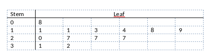

```{r, echo = FALSE, results = "hide"}
include_supplement("vufgb-median-001-nl-table01.jpg", recursive = TRUE)
```

Question
========

Gegeven is onderstaande stem-and-leaf plot met 13 observaties. Welke waarde heeft de mediaan?


  
Answerlist
----------
* 7
* 9
* 19
* 20

Solution
========

Answerlist
----------
* Incorrect
* Incorrect
* Correct
* Incorrect

Meta-information
================
exname: vufgb-median-001-nl
extype: schoice
exsolution: 0010
exsection: Descriptive statistics/Summary Statistics/Measures of Location/Median, Descriptive statistics/Data representation/Graphs/Stem and leaf plot
exextra[Type]: Interpretating graph
exextra[Program]: 
exextra[Language]: Dutch
exextra[Level]: Statistical Literacy
