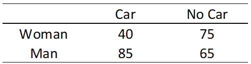

```{r, echo = FALSE, results = "hide"}
include_supplement("vufgb-oddsratio-001-en.png", recursive = TRUE)
```

Question
========
A researcher would like to know whether there is a difference between women (group 1) and men (group 2). The dependent variable is the likelihood of owning a car. Based on the table below, calculate the odds ratio indicating this difference.



The formula for the odds ratio: 

$$
θ = \frac{\frac{π_1}{(1-π_1)}}{\frac{π_2}{(1-π_2)}}
$$

Answerlist
----------
* 0.61 
* 0.41 
* 0.89
* 0.47

Meta-information
================
exname: vufgb-oddsratio-001-en
extype: schoice
exsolution: 0100
exsection: Descriptive statistics/Summary Statistics/Odds ratio
exextra[Type]: Calculation, Case
exextra[Language]: English
exextra[Level]: Statistical Thinking
