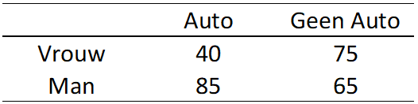

```{r, echo = FALSE, results = "hide"}
include_supplement("vufgb-oddsratio-001-nl.png", recursive = TRUE)
```

Question
========
Een onderzoeker wil weten of er een verschil is tussen vrouwen (groep 1) en mannen (groep 2). De afhankelijke variable is de waarschijnlijkheid dat iemand een auto bezit. Bereken op basis van onderstaande tabel de odds ratio voor dit verschil.



De formule voor de odds ratio: 

$$
θ = \frac{\frac{π_1}{(1-π_1)}}{\frac{π_2}{(1-π_2)}}
$$

Answerlist
----------
* 0.61 
* 0.41 
* 0.89
* 0.47

Meta-information
================
exname: vufgb-oddsratio-001-nl
extype: schoice
exsolution: 0100
exsection: Descriptive statistics/Summary Statistics/Odds ratio
exextra[Type]: Calculation, Case
exextra[Language]: Dutch
exextra[Level]: Statistical Thinking