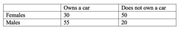

```{r, echo = FALSE, results = "hide"}
include_supplement("vufgb-oddsratio-002-en-table01.jpg", recursive = TRUE)
```

Question
========
  
A researcher would like to know if there is a difference between females (group 1) and males (group 2) in the share of owning a car. 

Based on the table below, calculate the odds ratio indicating this difference. 

Formula for the odds ratio:
  
$\theta = \frac{\frac{\pi_{1}}{(1-\pi_{1})}}{\frac{\pi_{2}}{(1-\pi_{2})}}$
  


Answerlist
----------
* 0.22
* 0.12
* 0.51
* 0.54

Solution
========
  
Answerlist
----------
* Correct
* Incorrect
* Incorrect
* Incorrect

Meta-information
================
exname: vufgb-oddsratio-002-en
extype: schoice
exsolution: 1000
exsection: Descriptive statistics/Summary Statistics/Odds ratio
exextra[Type]: Calculation
exextra[Program]: 
exextra[Language]: English
exextra[Level]: Statistical Thinking