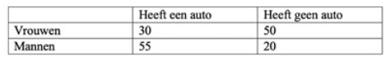

```{r, echo = FALSE, results = "hide"}
include_supplement("vufgb-oddsratio-002-nl-table01.jpg", recursive = TRUE)
```

Question
========
  
Een onderzoeker wil weten of er een verschil is tussen vrouwen (groep 1) en mannen (groep 2) in het aandeel mensen met een auto.

Bereken op basis van onderstaande tabel de **odds ratio** om dit verschil te weergeven.

Formule voor de odds ratio:

$\theta = \frac{\frac{\pi_{1}}{(1-\pi_{1})}}{\frac{\pi_{2}}{(1-\pi_{2})}}$
  

  
Answerlist
----------
* 0.22
* 0.12
* 0.51
* 0.54

Solution
========

Answerlist
----------
* Correct
* Incorrect
* Incorrect
* Incorrect

Meta-information
================
exname: vufgb-oddsratio-002-nl
extype: schoice
exsolution: 1000
exsection: Descriptive statistics/Summary Statistics/Odds ratio
exextra[Type]: Calculation
exextra[Program]: 
exextra[Language]: Dutch
exextra[Level]: Statistical Thinking