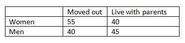

```{r, echo = FALSE, results = "hide"}
include_supplement("vufgb-oddsratio-003-en-table01.jpg", recursive = TRUE)
```

Question
========
  
A researcher would like to know whether there is a difference between female students
(group 1) and male students (group 2) in the share of students that have moved out 
of their parents' house. Based on the table below, calculate the odds ratio indicating
this difference. 

Formula for the odds ratio:
  
$\theta = \frac{\frac{\pi_{1}}{(1-\pi_{1})}}{\frac{\pi_{2}}{(1-\pi_{2})}}$
  


Answerlist
----------
* 1.23 
* 1.89 
* 1.55
* 1.37

Solution
========
  
Answerlist
----------
* Incorrect
* Incorrect
* Correct
* Incorrect

Meta-information
================
exname: vufgb-oddsratio-003-en
extype: schoice
exsolution: 0010
exsection: Descriptive statistics/Summary Statistics/Odds ratio
exextra[ID]: 2b59b
exextra[Type]: Calculation
exextra[Program]: 
exextra[Language]: English
exextra[Level]: Statistical Thinking
